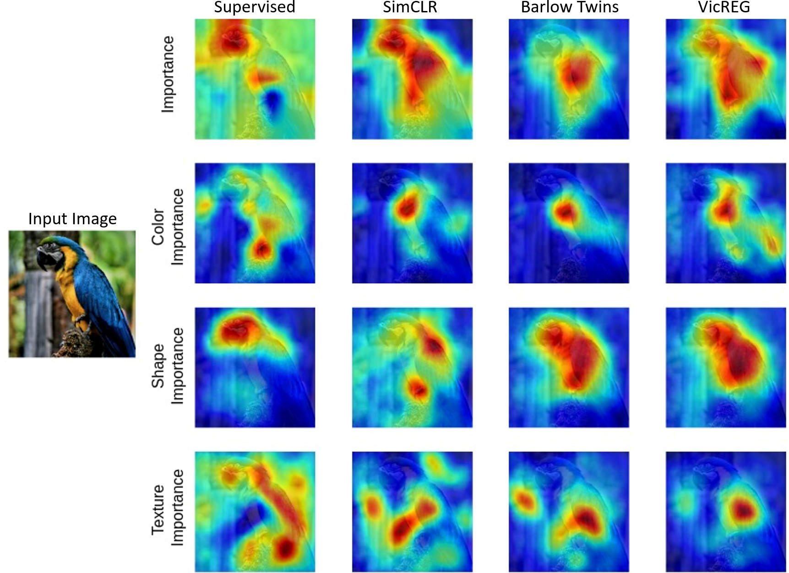

# Explaining-Representation-Learning-with-Perceptual-Components
Code for generating Explaining Representation Learning with Perceptual Components published at ICIP 2024.

**Abstract**. 

Self-supervised models create representation spaces that lack clear semantic meaning.  This interpretability problem of representations makes traditional explainability methods ineffective in this context. In this paper, we introduce a novel method to analyze representation spaces using three key perceptual components: color, shape, and texture. We employ selective masking of these components to observe changes in representations, resulting in distinct importance maps for each. In scenarios, where labels are absent, these importance maps provide more intuitive explanations as they are integral to the human visual system. Our approach enhances the interpretability of the representation space, offering explanations that resonate with human visual perception. We analyze how different training objectives create distinct representation spaces using perceptual components. Additionally, we examine the representation of images across diverse image domains, providing insights into the role of these components in different contexts.

    

**Paper** : https://arxiv.org/pdf/2406.06930

**Code Acknowledgements** :  The code is built on RELAX. We use the implementation of **https://github.com/Wickstrom/RELAX** as our base code.

**Citation** : Y. Yarici, K. Kokilepersaud, M. Prabhushankar, G. AlRegib, ”Explaining Representation
Learning with Perceptual Components,” in 2024 IEEE International Conference on Image Processing (ICIP), Abu Dhabi, United Arab Emirates (UAE), 2024.

**Bibtex** : @inproceedings{yarici2024xaiperceptual,
title={Explaining Representation Learning with Perceptual Components},
author={Yarici, Yavuz and Kokilepersaud, Kiran, and Prabhushankar, Mohit and AlRegib
Ghassan},
booktitle={ IEEE International Conference on Image Processing (ICIP)},
year={2024}}

